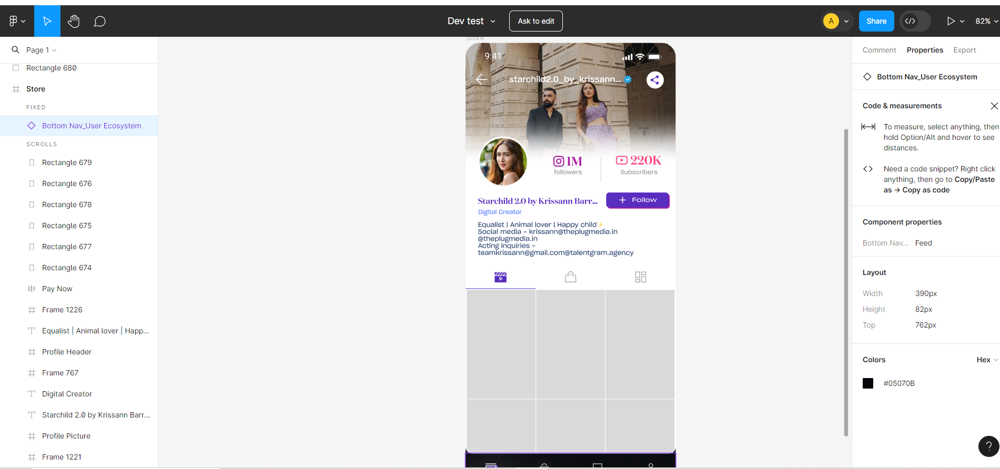

# Figma to React Conversion

## Overview

In this project, I demonstrate the process of converting a design mockup from Figma into a functional React application. The purpose of this project is to showcase my skills in front-end development, including HTML/CSS, JavaScript, and React.

[Click here for live demo](https://redesyn.vercel.app/)

## Design Mockup

The design mockup used in this project was created using Figma.

## Technologies Used

- React.js
- HTML/CSS
- Javascript

## Conversion Process

### Step 1: Analyzing the Design

### Step 2: Setting Up the React Project

### Step 3: Component Breakdown

### Step 4: Styling with CSS/Styled-components

### Step 5: Implementing Interactivity

### Step 6: Responsive Design

## How to Run the Project

1. Clone this repository to your local machine.
2. Navigate to the project directory.
3. Install dependencies using `npm install`.
4. Start the development server with `npm start`.
5. Open your browser and visit `http://localhost:3000` to view the application.

